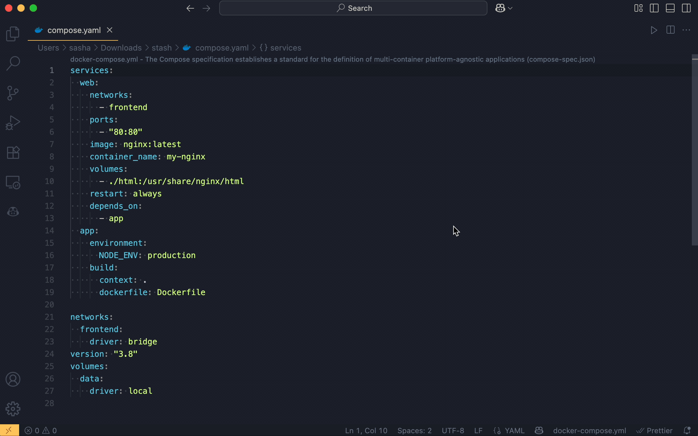

# YAML Compose Sorter

A Visual Studio Code extension that automatically sorts and formats Docker Compose YAML files in a consistent way across projects.

## Preview

## Features

- **Automatic sorting on save**: Sorts Docker Compose files automatically when you save them
- **Manual sorting command**: Sort files on demand using the command palette
- **Configurable key order**: Customize the order of top-level and service-level keys
- **Smart file detection**: Processes Docker Compose files with various naming patterns
- **Document separator**: Optionally adds `---` at the beginning of YAML files
- **Improved readability**: Adds blank lines between top-level keys for better visual separation
- **Version key removal**: Optionally removes the deprecated `version` key from Docker Compose files

## Supported File Patterns

The extension automatically detects and processes the following Docker Compose file patterns:

- `docker-compose.yaml`
- `docker-compose.yml`
- `compose.yaml`
- `compose.yml` 
- `docker-compose.*.yaml`
- `docker-compose.*.yml`
- `compose.*.yaml`
- `compose.*.yml`

## Usage

### Automatic Sorting

The extension automatically sorts Docker Compose files when you save them (if `sortOnSave` is enabled in settings).

### Manual Sorting

1. Open a Docker Compose file (`docker-compose.yaml`, `docker-compose.yml`, `compose.yaml`, `compose.yml`, etc.)
2. Open the Command Palette (`Cmd+Shift+P` on Mac, `Ctrl+Shift+P` on Windows/Linux)
3. Type "Sort Docker Compose YAML" and press Enter

## Configuration

You can customize the extension behavior in VS Code settings:

| Setting                                      | Description                                                                                  | Default Value |
|----------------------------------------------|----------------------------------------------------------------------------------------------|---------------|
| `yaml-compose-sorter.sortOnSave`             | Enable or disable automatic sorting on save                                                  | `true`        |
| `yaml-compose-sorter.topLevelKeyOrder`       | Array of top-level key names in the desired order                                            | `[version, name, services, volumes, networks, configs, secrets]` |
| `yaml-compose-sorter.serviceKeyOrder`        | Array of service-level key names in the desired order                                        | `[container_name, image, build, restart, depends_on, ports, expose, volumes, environment, env_file, networks, labels, healthcheck]` |
| `yaml-compose-sorter.addDocumentSeparator`   | Add `---` document separator at the beginning of YAML files                                 | `false`       |
| `yaml-compose-sorter.addBlankLinesBetweenTopLevelKeys` | Add blank lines between top-level keys for improved readability                              | `true`        |
| `yaml-compose-sorter.removeVersionKey`       | Automatically remove the deprecated `version` key from Docker Compose files                 | `false`       |

### Example Configuration

You can see an example configuration in the file `example-settings.json` included in the project.

## Requirements

- Visual Studio Code 1.101.0 or higher
- Docker Compose YAML files must be valid YAML format

## Known Issues

- Comments in YAML files may be lost during sorting (this is a limitation of the YAML parser)
- Complex YAML features like anchors and aliases are not preserved
