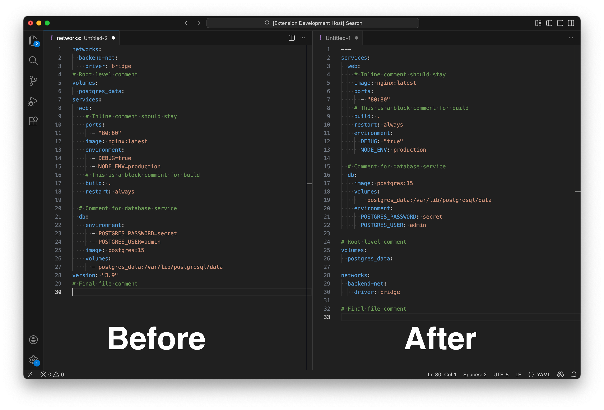

<div align="center">

[](https://marketplace.visualstudio.com/items?itemName=SashaBusinaro.yaml-compose-sorter)
[](https://marketplace.visualstudio.com/items?itemName=SashaBusinaro.yaml-compose-sorter)
[](https://marketplace.visualstudio.com/items?itemName=SashaBusinaro.yaml-compose-sorter)

</div>

# Docker Compose Sorter

*(Formerly known as YAML Compose Sorter)*

A Visual Studio Code extension that automatically sorts, formats, and standardizes Docker Compose files. It ensures consistency across your projects by enforcing a specific order for keys and services.

## Preview



## What's New in v1.0.0

> **Comment Preservation**: We now use a powerful AST parser. Your comments (inline and blocks) are now perfectly preserved and moved along with their keys!
- **Native Formatter API**: The extension now works as a standard VS Code formatter.
- **Smarter Detection**: Automatically detects files with the `dockercompose` language ID (if the Docker extension is installed) or falls back to file patterns.

## Features

- **Standardized Sorting**: Enforce a consistent order for top-level keys (`version`, `services`, `volumes`, etc.) and service-level keys (`image`, `environment`, `ports`, etc.).
- **Native Formatting**: Works with the standard "Format Document" command and "Format On Save".
- **Document Separator**: Optionally adds `---` at the beginning of YAML files.
- **Visual Separation**: Adds blank lines between services and top-level blocks for better readability.
- **Key=Value Transformation**: Optionally converts legacy list syntax (e.g., in `labels`) to map syntax.
- **Clean Up**: Optionally removes the deprecated `version` key.
- **Custom Key Support**: Add custom keys to the `topLevelKeyOrder` or `serviceKeyOrder` arrays in your `settings.json` to include them in the sorting logic.


## Usage & Configuration

### 1. Enabling "Format on Save" (Recommended)

In v1.0.0, we removed the custom `sortOnSave` setting in favor of the native VS Code API. To sort your files automatically when saving, add this to your `settings.json`:

```json
"[dockercompose]": {
  "editor.defaultFormatter": "SashaBusinaro.yaml-compose-sorter",
  "editor.formatOnSave": true
},
"[yaml]": {
  "editor.defaultFormatter": "SashaBusinaro.yaml-compose-sorter",
  "editor.formatOnSave": true
}

```

### 2. Manual Sorting

You can trigger the sort manually at any time:

* **Right-click** inside the editor and select **Format Document**.
* Or open the **Command Palette** (`Cmd+Shift+P` / `Ctrl+Shift+P`) and type **"Sort Docker Compose"**.

## Supported Files

The extension activates automatically for:

1. Files with the `dockercompose` Language Mode (requires Microsoft Docker extension).
2. Files matching these patterns:
* `docker-compose.yaml` / `.yml`
* `compose.yaml` / `.yml`
* `*.docker-compose.yaml` / `*.compose.yaml` (and variants)


## Extension Settings

You can customize the sorting behavior in VS Code settings.

| Setting | Default | Description |
| --- | --- | --- |
| `yaml-compose-sorter.topLevelKeyOrder` | `[version, name, services...]` | Order of root keys (e.g., put `volumes` at the end). |
| `yaml-compose-sorter.serviceKeyOrder` | `[image, build, ...]` | Order of keys inside a service definition. |
| `yaml-compose-sorter.addBlankLinesBetweenTopLevelKeys` | `true` | Adds a blank line between root blocks (e.g., between `services` and `networks`). |
| `yaml-compose-sorter.addBlankLinesBetweenServices` | `true` | Adds a blank line between each service definition. |
| `yaml-compose-sorter.addDocumentSeparator` | `false` | Ensures the file starts with `---`. |
| `yaml-compose-sorter.removeVersionKey` | `false` | Removes the `version` key (deprecated in recent Compose specs). |
| `yaml-compose-sorter.transformKeyValueLists` | `false` | Converts array syntax to map syntax (see example below). |

### Feature Spotlight: Key=Value Transformation

If you enable `transformKeyValueLists`, the extension converts array-based configurations into cleaner YAML maps.

**Before:**

```yaml
labels:
  - "traefik.enable=true"
  - "traefik.http.routers.web.rule=Host(`example.org`)"

```

**After:**

```yaml
labels:
  traefik.enable: "true"
  traefik.http.routers.web.rule: "Host(`example.org`)"

```

### Example Configuration

You can see an example configuration in the file `example-settings.json` included in the project.

## Requirements

* Visual Studio Code 1.101.0 or higher.