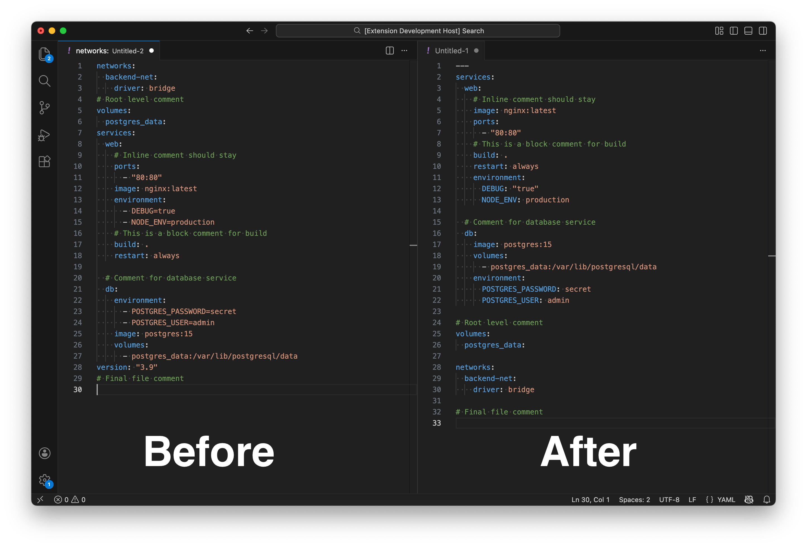

<div align="center">

[](https://marketplace.visualstudio.com/items?itemName=SashaBusinaro.yaml-compose-sorter)
[](https://marketplace.visualstudio.com/items?itemName=SashaBusinaro.yaml-compose-sorter)
[](https://marketplace.visualstudio.com/items?itemName=SashaBusinaro.yaml-compose-sorter)
[](https://github.com/SashaBusinaro/yaml-compose-sorter/actions/workflows/ci.yml)
[](LICENSE)

</div>

# Docker Compose Sorter

_(Formerly known as YAML Compose Sorter)_

A Visual Studio Code extension that automatically sorts, formats, and standardizes Docker Compose files. It ensures consistency across your projects by enforcing a specific order for keys and services.

## Preview



## Features

- **Standardized Sorting**: Enforce a consistent order for top-level keys (`version`, `services`, `volumes`, etc.) and service-level keys (`image`, `environment`, `ports`, etc.).
- **Native Formatting**: Works with the standard "Format Document" command and "Format On Save".
- **Document Separator**: Optionally adds `---` at the beginning of YAML files.
- **Visual Separation**: Adds blank lines between services and top-level blocks for better readability.
- **Key=Value Transformation**: Optionally converts legacy list syntax (e.g., in `labels`) to map syntax.
- **Clean Up**: Optionally removes the deprecated `version` key.
- **Custom Key Support**: Add custom keys to the `topLevelKeyOrder` or `serviceKeyOrder` arrays in your `settings.json` to include them in the sorting logic.

## Usage & Configuration

### 1. Enabling "Format on Save" (Recommended)

In v1.0.0, we removed the custom `sortOnSave` setting in favor of the native VS Code API. To sort your files automatically when saving, add this to your `settings.json`:

```json
"[dockercompose]": {
  "editor.defaultFormatter": "SashaBusinaro.yaml-compose-sorter",
  "editor.formatOnSave": true
},
"[yaml]": {
  "editor.defaultFormatter": "SashaBusinaro.yaml-compose-sorter",
  "editor.formatOnSave": true
}

```

### 2. Manual Sorting

You can trigger the sort manually at any time:

- **Right-click** inside the editor and select **Format Document**.
- Or open the **Command Palette** (`Cmd+Shift+P` / `Ctrl+Shift+P`) and type **"Sort Docker Compose"**.

## Supported Files

The extension activates automatically for:

1. Files with the `dockercompose` Language Mode (requires Microsoft Docker extension).
2. Files matching these patterns:

- `docker-compose.yaml` / `.yml`
- `compose.yaml` / `.yml`
- `*.docker-compose.yaml` / `*.compose.yaml` (and variants)

## Extension Settings

You can customize the sorting behavior in VS Code settings.

| Setting                                                | Default                        | Description                                                                      |
| ------------------------------------------------------ | ------------------------------ | -------------------------------------------------------------------------------- |
| `yaml-compose-sorter.topLevelKeyOrder`                 | `[version, name, services...]` | Order of root keys (e.g., put `volumes` at the end).                             |
| `yaml-compose-sorter.serviceKeyOrder`                  | `[container_name, image, ...]` | Order of keys inside a service definition.                                       |
| `yaml-compose-sorter.addBlankLinesBetweenTopLevelKeys` | `true`                         | Adds a blank line between root blocks (e.g., between `services` and `networks`). |
| `yaml-compose-sorter.addBlankLinesBetweenServices`     | `true`                         | Adds a blank line between each service definition.                               |
| `yaml-compose-sorter.addDocumentSeparator`             | `false`                        | Ensures the file starts with `---`.                                              |
| `yaml-compose-sorter.removeVersionKey`                 | `false`                        | Removes the `version` key (deprecated in recent Compose specs).                  |
| `yaml-compose-sorter.transformKeyValueLists`           | `false`                        | Converts array syntax to map syntax (see example below).                         |

### Feature Spotlight: Key=Value Transformation

If you enable `transformKeyValueLists`, the extension converts array-based configurations into cleaner YAML maps.

**Before:**

```yaml
labels:
  - "traefik.enable=true"
  - "traefik.http.routers.web.rule=Host(`example.org`)"
```

**After:**

```yaml
labels:
  traefik.enable: "true"
  traefik.http.routers.web.rule: "Host(`example.org`)"
```

### Example Configuration

You can see an example configuration in the file `example-settings.json` included in the project.

## Formatting Behavior Notes

- **Line endings**: the original line endings of the file (LF or CRLF) are preserved.
- **Multi-document files**: files containing multiple YAML documents separated by `---` are fully supported — every document is sorted and none is dropped.
- **Extension fields (`x-*`)**: top-level extension fields not listed in `topLevelKeyOrder` are placed at the top of the file, keeping their original relative order. This guarantees YAML anchors defined in `x-*` blocks stay above the services that reference them.
- **Indentation**: the indent width follows your editor settings (`editor.tabSize`). Since YAML forbids tab indentation, 2 spaces are used when the editor is configured for tabs.
- **Blank lines**: consecutive blank lines are normalized to a single blank line.

## Requirements

- Visual Studio Code 1.101.0 or higher.

## Release Notes

See the [CHANGELOG](CHANGELOG.md) for the full release history.
