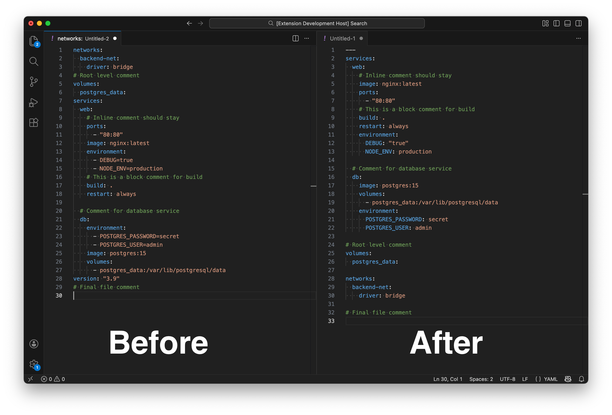

<div align="center">

[](https://marketplace.visualstudio.com/items?itemName=SashaBusinaro.yaml-compose-sorter)
[](https://marketplace.visualstudio.com/items?itemName=SashaBusinaro.yaml-compose-sorter)
[](https://marketplace.visualstudio.com/items?itemName=SashaBusinaro.yaml-compose-sorter)
[](https://github.com/SashaBusinaro/yaml-compose-sorter/actions/workflows/ci.yml)
[](LICENSE)

</div>

# Docker Compose Sorter

_(Formerly known as YAML Compose Sorter)_

A Visual Studio Code extension that automatically sorts, formats, and standardizes Docker Compose files. It ensures consistency across your projects by enforcing a specific order for keys and services.

## Preview



## Features

- **Standardized Sorting**: Enforce a consistent order for top-level keys (`version`, `services`, `volumes`, etc.) and service-level keys (`image`, `environment`, `ports`, etc.).
- **Native Formatting**: Works with the standard "Format Document" command and "Format On Save".
- **Document Separator**: Optionally adds `---` at the beginning of YAML files.
- **Visual Separation**: Adds blank lines between services and top-level blocks for better readability.
- **Grouped Service Sorting**: Optionally organizes service keys into ordered groups with blank lines between groups.
- **Key=Value Transformation**: Optionally converts legacy list syntax (e.g., in `labels`) to map syntax.
- **Clean Up**: Optionally removes the deprecated `version` key.
- **Custom Key Support**: Add custom keys to the `topLevelKeyOrder` or `serviceKeyOrder` arrays in your `settings.json` to include them in the sorting logic.

## Usage & Configuration

### 1. Enabling "Format on Save" (Recommended)

In v1.0.0, we removed the custom `sortOnSave` setting in favor of the native VS Code API. To sort your files automatically when saving, add this to your `settings.json`:

```json
"[dockercompose]": {
  "editor.defaultFormatter": "SashaBusinaro.yaml-compose-sorter",
  "editor.formatOnSave": true
},
"[yaml]": {
  "editor.defaultFormatter": "SashaBusinaro.yaml-compose-sorter",
  "editor.formatOnSave": true
}

```

### 2. Manual Sorting

You can trigger the sort manually at any time:

- **Right-click** inside the editor and select **Format Document**.
- Or open the **Command Palette** (`Cmd+Shift+P` / `Ctrl+Shift+P`) and type **"Sort Docker Compose"**.

## Supported Files

The formatter supports any file with the `dockercompose` Language Mode, plus Compose files in `yaml`, `jinja`, `jinja-yaml`, or `plaintext` mode matching these patterns:

- `docker-compose.yaml` / `.yml` (and `.j2` template variants)
- `compose.yaml` / `.yml` (and `.j2` template variants)
- `docker-compose.prod.yaml` / `compose.dev.yaml` and similar `docker-compose.*.yml` / `compose.*.yml` variants (including `.j2` templates)
- Names starting with `docker-compose` or `compose` and ending in `.j2`, `.jinja`, or `.jinja2`

> [!NOTE]
> For Jinja2 templates (`.j2`, `.jinja`, `.jinja2`), variable interpolations must be quoted (e.g., `image: "{{ web_image }}"`) to adhere to standard YAML syntax and ensure clean AST parsing.

## Extension Settings

You can customize the sorting behavior in VS Code settings.

| Setting                                                        | Default                          | Description                                                                      |
| -------------------------------------------------------------- | -------------------------------- | -------------------------------------------------------------------------------- |
| `yaml-compose-sorter.topLevelKeyOrder`                         | `[version, name, services...]`   | Order of root keys (e.g., put `volumes` at the end).                             |
| `yaml-compose-sorter.serviceKeyOrder`                          | `[container_name, image, ...]`   | Order of keys inside a service definition.                                       |
| `yaml-compose-sorter.serviceKeyGroups`                         | `[[container_name], [image...]]` | Ordered service-key groups used when group mode is enabled.                      |
| `yaml-compose-sorter.useServiceKeyGroups`                      | `false`                          | Uses `serviceKeyGroups` instead of `serviceKeyOrder` when groups are configured. |
| `yaml-compose-sorter.preserveBlankLinesWithinServiceKeyGroups` | `true`                           | Preserves blank lines within groups and between unknown service keys.            |
| `yaml-compose-sorter.addBlankLinesBetweenTopLevelKeys`         | `true`                           | Adds a blank line between root blocks (e.g., between `services` and `networks`). |
| `yaml-compose-sorter.addBlankLinesBetweenServices`             | `true`                           | Adds a blank line between each service definition.                               |
| `yaml-compose-sorter.addDocumentSeparator`                     | `false`                          | Ensures the file starts with `---`.                                              |
| `yaml-compose-sorter.removeVersionKey`                         | `false`                          | Removes the `version` key (deprecated in recent Compose specs).                  |
| `yaml-compose-sorter.transformKeyValueLists`                   | `false`                          | Converts array syntax to map syntax (see example below).                         |

### Grouped Service Keys

The default groups mirror the existing `serviceKeyOrder` exactly, without moving any keys. To customize them, set `serviceKeyGroups` to a list of key lists and enable `useServiceKeyGroups`. Groups are processed in declaration order, keys within each group follow their listed order, and unlisted keys are sorted alphabetically after the groups. A blank line is inserted between populated groups. The list format makes the setting override cleanly across VS Code configuration scopes instead of merging named object properties.

```json
"yaml-compose-sorter.serviceKeyGroups": [
  ["container_name"],
  ["image", "build"],
  ["restart", "depends_on"],
  ["ports", "expose"],
  ["volumes"],
  ["environment", "env_file"],
  ["networks"],
  ["labels", "healthcheck"]
],
"yaml-compose-sorter.useServiceKeyGroups": true,
"yaml-compose-sorter.preserveBlankLinesWithinServiceKeyGroups": true
```

Grouped service sorting is disabled by default. Set `useServiceKeyGroups` to `true` to use the grouped order and insert blank lines between populated groups. By default, existing blank lines within a group and between unknown service keys are preserved; set `preserveBlankLinesWithinServiceKeyGroups` to `false` to remove them.

### Feature Spotlight: Key=Value Transformation

If you enable `transformKeyValueLists`, the extension converts array-based configurations into cleaner YAML maps.

Conversion applies to service `environment`, `labels`, and `extra_hosts`; build `args`, `labels`, and `extra_hosts`; deploy `labels`; and lifecycle-hook `environment`. Aliases and merged fragments used in these contexts are supported. Unused extension data and unrelated fields are preserved.

Collection anchors, comments, blank lines, and Compose `!override` / `!reset` tags survive conversion. Lists containing anchored or explicitly tagged scalar items, duplicate keys, or entries without `=` are left unchanged. Whitespace in key names is preserved.

**Before:**

```yaml
labels:
  - "traefik.enable=true"
  - "traefik.http.routers.web.rule=Host(`example.org`)"
```

**After:**

```yaml
labels:
  traefik.enable: "true"
  traefik.http.routers.web.rule: "Host(`example.org`)"
```

### Example Configuration

You can see an example configuration in the file `example-settings.json` included in the project.

## Formatting Behavior Notes

- **Line endings**: the original line endings of the file (LF or CRLF) are preserved.
- **Multi-document files**: files containing multiple YAML documents separated by `---` are fully supported — every document is sorted and none is dropped.
- **Comments**: file headers stay at the start, and comments associated with other keys move with those keys. Comments on a removed `version` key are retained at the start of the document.
- **Extension fields (`x-*`) and anchors**: top-level extension fields keep their original relative order and are normally placed before Compose sections, including when they appear in a custom key order. The relative order of blocks containing anchors or aliases takes precedence over configured sorting, preserving forward-reference validity and shadowed anchor bindings.
- **Version removal**: a `version` key that defines an anchor still referenced elsewhere is retained to keep the document valid.
- **Indentation**: the indent width follows your editor settings (`editor.tabSize`). Since YAML forbids tab indentation, 2 spaces are used when the editor is configured for tabs.
- **Blank lines**: consecutive blank lines are normalized to a single blank line.

## Requirements

- Visual Studio Code 1.101.0 or higher.

## Release Notes

See the [CHANGELOG](CHANGELOG.md) for the full release history.
